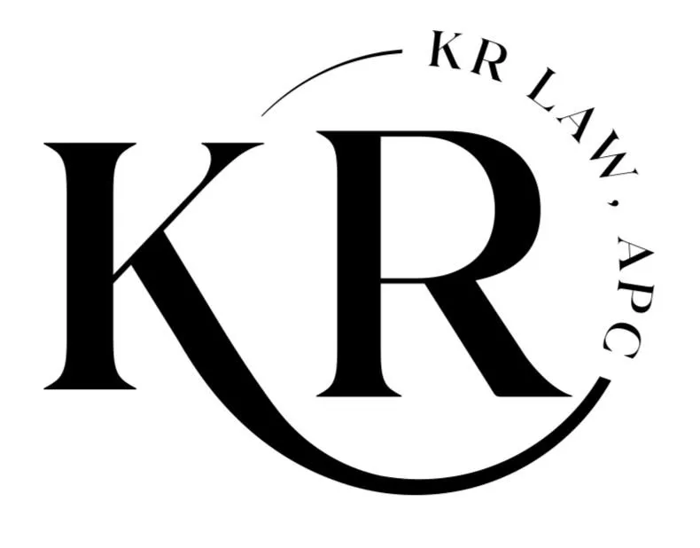

<div align="center">
  
</div>

# KR Law - Personal Injury Law Firm Website

## Overview

KR Law is a modern, responsive website built with React and Vite for a personal injury law firm specializing in various accident cases including car accidents, pedestrian accidents, wrongful death claims, and more. The website provides potential clients with information about the firm's services, practice areas, and ways to get legal assistance.

## Features

- Responsive design optimized for all devices
- Dedicated sections for different practice areas and accident types
- Consultation request forms for potential clients
- Attorney profiles and credentials showcase
- Testimonials from previous clients
- Frequently asked questions section
- News and updates about the firm
- Contact information and location details

## Technologies

- React 18 - Frontend framework
- Vite - Build tool and development server
- ESLint - Code quality and style enforcement
- CSS3 - Styling and animations

## Project Structure

```
kr_law/
├── public/                   # Static files and favicons
├── src/                      # Source files
│   ├── assets/               # Images and media files
│   │   ├── home_imgs/        # Homepage and practice area images
│   │   └── images/           # General website images
│   ├── components/           # React components
│   │   ├── about/            # About firm and partners components
│   │   ├── common/           # Shared components (header, footer, etc.)
│   │   ├── contact/          # Contact forms and pages
│   │   └── home/             # Homepage sections components
│   ├── App.jsx               # Main App component
│   ├── index.css             # Global styles
│   └── main.jsx              # Application entry point
├── eslint.config.js          # ESLint configuration
├── index.html                # HTML template
├── package.json              # Project dependencies
└── vite.config.js            # Vite configuration
```

## Getting Started

### Prerequisites

- Node.js (v16 or later)
- npm or yarn

### Installation

1. Clone the repository
   ```
   git clone https://github.com/yourusername/kr_law.git
   ```
2. Navigate to project directory
   ```
   cd kr_law
   ```
3. Install dependencies
   ```
   npm install
   ```

### Running the Development Server

```
npm run dev
```

### Building for Production

```
npm run build
```

## Key Component Sections

- **Hero Section**: Main landing banner with call-to-action
- **Practice Areas**: Showcases different accident types the firm handles
- **Attorney Profiles**: Information about the firm's lawyers
- **Testimonials**: Client reviews and success stories
- **Millions Recovered**: Case results and settlements achieved
- **FAQ**: Common questions about personal injury claims
- **Contact Forms**: Multiple ways for potential clients to reach out

## Customization

The website can be easily customized by:

1. Updating images in the assets folder
2. Modifying component text in respective JSX files
3. Adjusting the styling in index.css or component-specific CSS files
4. Adding new practice areas or sections as needed

## Performance Optimization

- WebP image format used for faster loading
- Component-based architecture for better code organization
- Vite's fast HMR (Hot Module Replacement) for efficient development

## Browser Compatibility

- Chrome, Firefox, Safari, and Edge (latest versions)
- Responsive design for mobile and tablet devices

## License

All rights reserved. This project is proprietary and confidential.

## Support

For issues, suggestions or contributions, please contact the development team.
